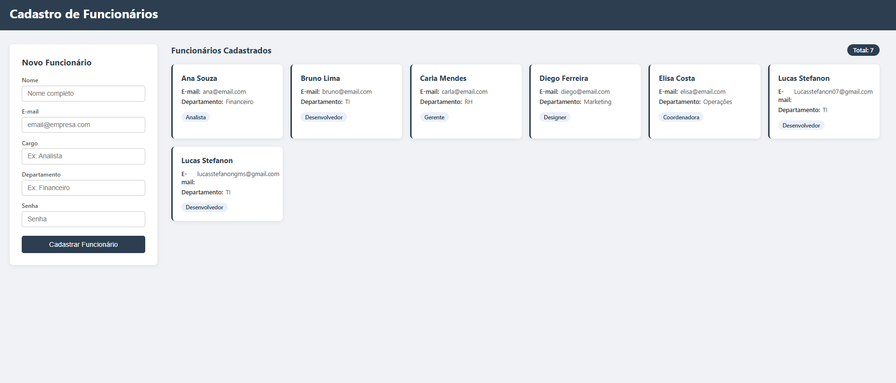
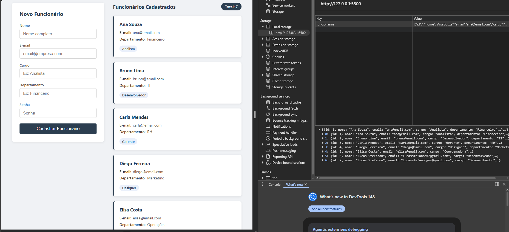

# Cadastro de Funcionários

**Nome:** Lucas Stefanon  
**Matrícula:** 1659984

## Sobre

Aplicação web para cadastro de funcionários com persistência via LocalStorage. Permite cadastrar, listar e manter dados após atualizar o navegador.

## Funcionalidades

- Cadastro de funcionários (nome, e-mail, cargo, departamento, senha)
- Listagem em cards dinâmicos
- Persistência com LocalStorage
- Contador de funcionários cadastrados
- 5 funcionários pré-cadastrados ao inicializar

## Prints

### Aplicação com funcionários cadastrados

### LocalStorage no navegador

